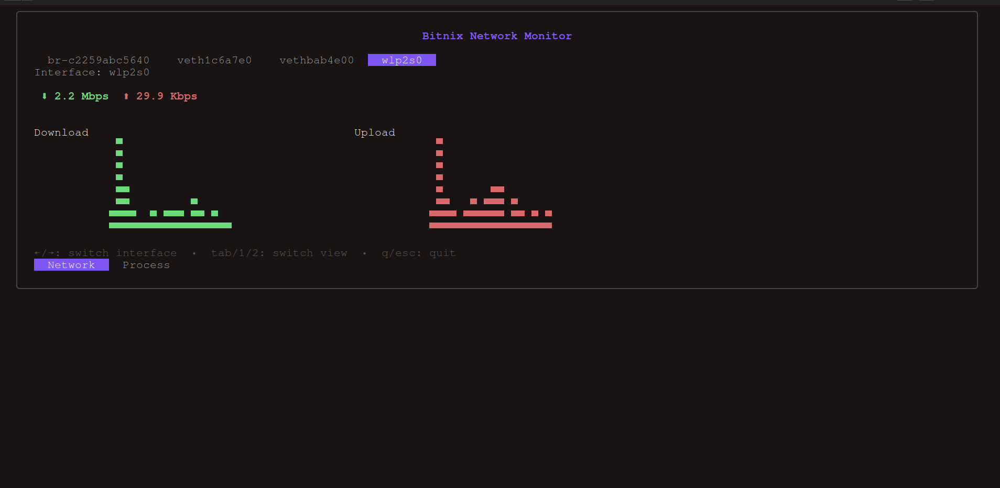
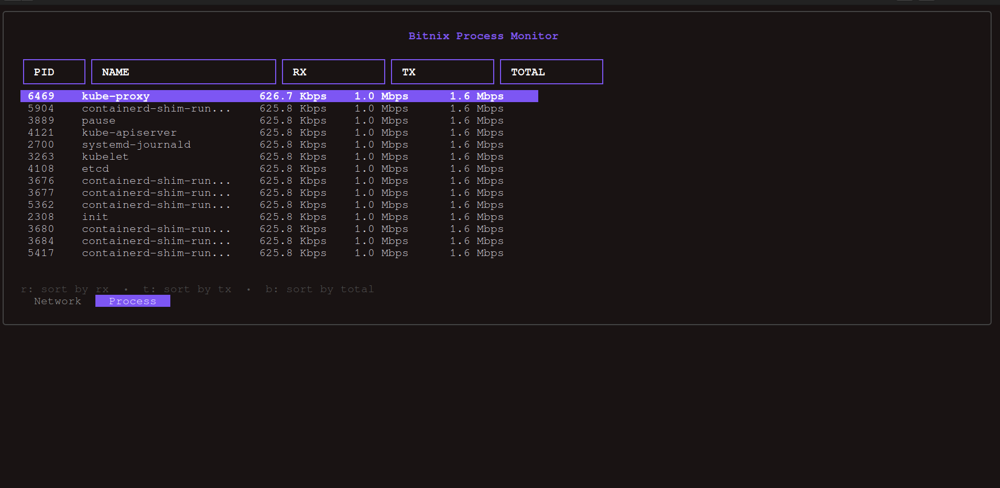

# Bitnix - A Terminal-Based Network and Process Monitor

Bitnix is a lightweight, terminal-based tool for monitoring network traffic and process activity on your Linux system. It provides a real-time view of your network interfaces and the processes that are using the network.

## Features

*   **Network Monitoring**: View real-time download and upload speeds for each network interface.
*   **Process Monitoring**: See a list of processes and their network usage (RX and TX).
*   **Interactive TUI**: A user-friendly terminal interface built with Bubble Tea.
*   **Sorting**: Sort processes by total network usage, received data, or transmitted data.
*   **Graphs**: Visualize network traffic with historical graphs.

## Screenshots

### Network Monitor


### Process Monitor


## How to run

1.  Clone the repository:
    ```bash
    git clone https://github.com/maheshbhatiya73/bitnix.git
    ```
2.  Navigate to the project directory:
    ```bash
    cd bitnix
    ```
3.  Run the application:
    ```bash
    go run main.go
